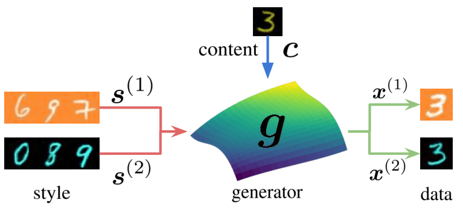
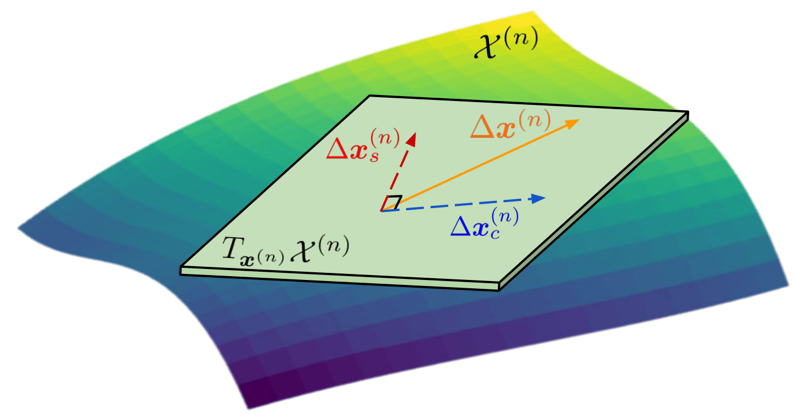
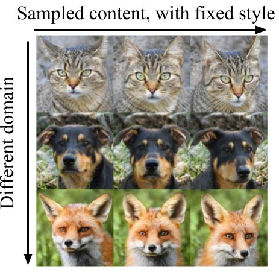
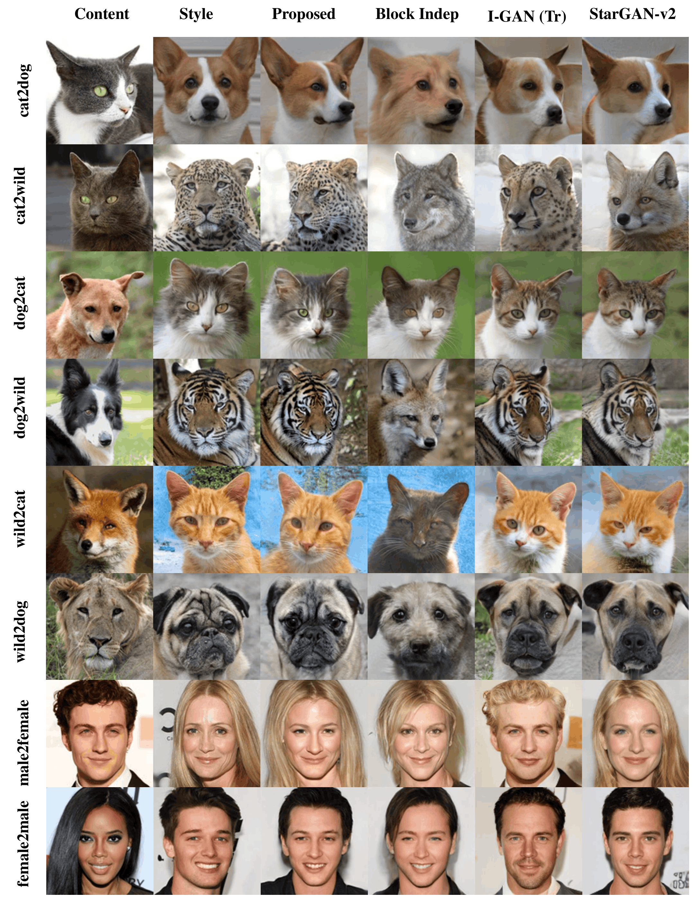
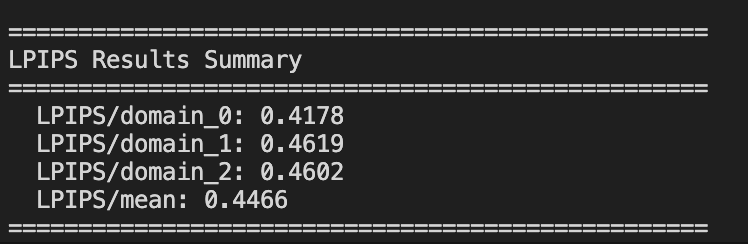
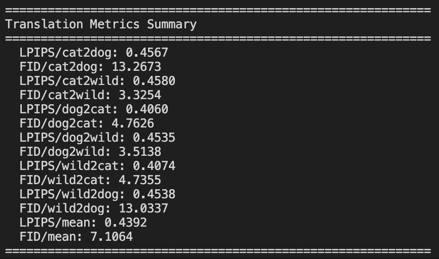

# Content-Style Identification via Differential Independence

This repository contains the official code to reproduce the experiments in the paper:

[**"Content-Style Identification via Differential Independence"**](https://subashtimilsina.github.io)

The codebase is organized into two self-contained sets of experiments:

- `High Resolution Experiments/` — content–style disentangled generation and translation on **AFHQ** and **CelebA-HQ**.
- `MNIST Experiments/` — content–style disentangled generation and translation on **Colored MNIST** variants.

---

## Method Overview

### Generative model

We assume the observed data is produced by a shared generator `g` that mixes a **content** latent `c` with a **domain-specific style** latent `s^(n)`. For each domain `n`, samples are generated as `x^(n) = g(c, s^(n))`. The same content (e.g., the digit "3") combined with different styles produces samples that look the same in semantics but differ in appearance across domains.



### CSDI regularization (Differential Independence)

Standard independence-based disentanglement fails when content and style are statistically correlated. CSDI replaces it with a **local, geometric** condition: at every sample `x^(n) = g(c, s^(n))`, the directions of variation induced by perturbing content (`Δx_c^(n)`) must be **orthogonal** to those induced by perturbing style (`Δx_s^(n)`):

`R(J_c g(c, s^(n))) ⊥ R(J_{s^(n)} g(c, s^(n)))`.



In practice, this is enforced as a regularizer that penalizes correlation between the content and style Jacobians of the generator, yielding identifiable content–style separation across domains.

---

## Citation

If you use this work, please cite the paper using the following BibTeX entry:

```bibtex
@inproceedings{timilsina2026identifiable,
  title     = {Content-Style Identification via Differential Independence},
  author    = {Timilsina, Subash and Nguyen, Hoang-Son and Shrestha, Sagar and Fu, Xiao},
  booktitle = {Proceedings of the 43rd International Conference on Machine Learning},
  year      = {2026},
}
```

---

## Prerequisites

### Setting up the environment

Create the `i2i` conda environment from the provided `environment.yml` file and activate it:

```bash
conda env create -f environment.yml
conda activate i2i
```

All commands below assume the `i2i` environment is active.

---

## 1. AFHQ and CelebA-HQ Experiments

All commands in this section are run from the `High Resolution Experiments/` directory:

```bash
cd "High Resolution Experiments"
```

### 1.1 Prepare the datasets

Download the AFHQ and CelebA-HQ datasets, then convert and downsample them to the resolution used for training:

```bash
bash dataset_scripts/download.sh
bash dataset_scripts/prepare_dataset.sh
```

### 1.2 Train the models

Train one model per dataset:

```bash
bash training_scripts/afhq.sh
bash training_scripts/celebahq.sh
```

### 1.3 Evaluation

#### Generation

Generate samples that share content or share style across the learned domains:

```bash
bash evaluation_scripts/generate.sh
```



#### Translation

Perform content–style translation between domains (e.g., cat ↔ dog for AFHQ):

```bash
bash evaluation_scripts/translate.sh
```



#### Generation metrics (LPIPS)

Compute the LPIPS-based generation metrics:

```bash
bash evaluation_scripts/calculate_lpips.sh
```

The output should look like the following:



#### Translation metrics

Compute the translation metrics:

```bash
bash evaluation_scripts/calculate_translation_metrics.sh
```

The output should look like the following:



---

## 2. Colored MNIST Experiments

All commands in this section are run from the `MNIST Experiments/` directory:

```bash
cd "MNIST Experiments"
```

### 2.1 Prepare the dataset

Open `prepare_dependent_mnist.py` and set the `main_path` variable to the directory where the MNIST variants should be stored. Then build the dataset:

```bash
python prepare_dependent_mnist.py
```

### 2.2 Train the model

Open `train.sh` and set the `--main_path` argument to the same directory used above. Then start training:

```bash
bash train.sh
```

### 2.3 Results

In every grid below, the first row corresponds to **domain 1** (colored digits) and **domain 2** (colored background).

#### Generation


#### Translation


